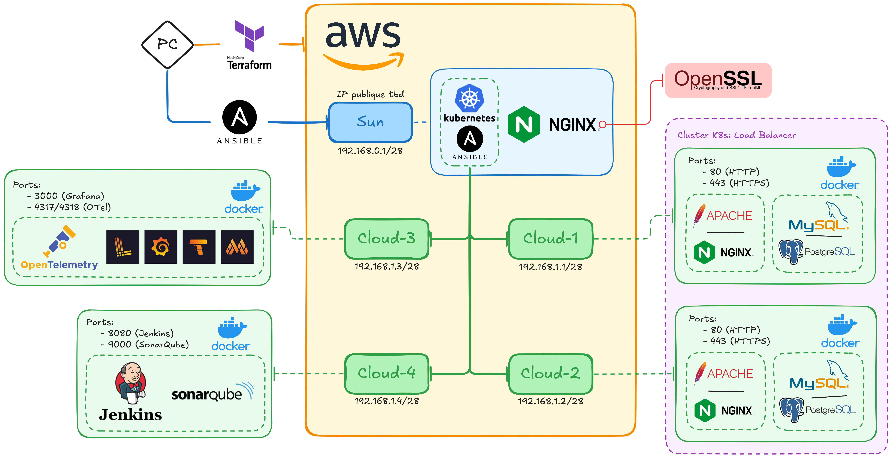

# Infrastructure ASD

## Shéma

### Fonctionnement de l'installation

Depuis la machine locale:
- Création de 5 machines sur AWS depuis la machine locale avec l'aide de Terraform:
    - Création des machines EC2
    - Création d'un bucket S3
    - Mise en place du VPC avec une instance ("Sun") dans un sous réseau publique et 4 machines ("Cloud-1", "Cloud-2", "Cloud-3" et "Cloud-4") dans un sous réseau privé
    - Récupération de l'adresse IP de l'instance pour le pointage et la propagation DNS

- Mise à jour et installation d'applications sur la machine "Sun" avec Ansible:
    - Installations de Kubernetes et Ansible pour le paramétrage des machines "Cloud-n"
    - Installation de Nginx pour la création d'un reverse proxy
    - Installation de OpenSSL pour la création des certificats

Sur la machine "Sun":
- Mise à jour et installation d'applications sur les machines "Cloud-n":
    - Installation de Docker

- Création des différents containers Docker:
    - Cloud-1 et Cloud-2:
        - Création d'un cluster K8s
        - Création de deux containers "WebServer" et "DataBase"
        - Synchronisation des deux base de données
    - Cloud-3:
        - Création d'un container avec OpenTelemetry et la suite Grafana
    - Cloud-4:
        - Création d'un container Jenkins et un container SonarQube